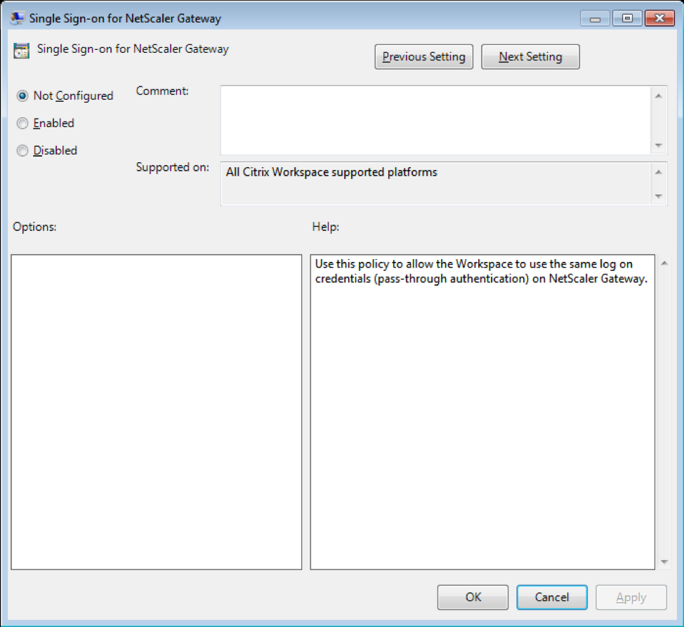

# Storebrowse for Workspace app for Windows

Storebrowse is a lightweight command-line utility that is used to interact between the client and the server. It is used to authenticate all the operations within StoreFront and with NetScaler Gateway.

Using Storebrowse utility, administrators can automate the following day-to-day operations:

* Add a store
* Enumerate the published desktops and applications from a configured store
* Generate an ICA file by selecting any published desktop or application manually
* Generate an ICA file using the Storebrowse command-line
* Launch the published application 

The Storebrowse utility is now part of Authmanager component. After installing the Citrix Workspace, the Storebrowse utility is located in the AuthManager installation folder.

You can confirm if Storebrowse is installed along with the Authmanager component by checking the registry path in the following ways

## When Workspace is installed by administrators

**For 32 bit machine**

```
[HKEY_LOCAL_MACHINE\SOFTWARE\Citrix\AuthManager\Install]
```

**For 64 bit machine**

```
[HKEY_LOCAL_MACHINE\SOFTWARE\WOW6432Node\Citrix\AuthManager\Install] 
```

When Workspace is installed by end-users:

**For 32 bit machine**

```
[HKEY_CURRENT_USER\SOFTWARE\Citrix\AuthManager\Install]
```

**For 64 bit machine**

```
[HKEY_CURRENT_USER\SOFTWARE\WOW6432Node\Citrix\AuthManager\Install]
```

## What’s New

### NetScaler Gateway Support

With the latest release of Storebrowse utility, you can now add a NetScaler Gateway URL. No additional configuration is required in the Storebrowse utility to communicate with NetScaler Gateway.  

### Single Sign-on Support with NetScaler Gateway:

Additional to the newly added NetScaler Gateway support, you can now use Single Sign-on with it. You can add a new store and enumerate the published resources without having to provide your user credentials.

**Note**: This feature is supported only on domain-joined machines where NetScaler Gateway is configured with the Single Sign-on authentication.

### Launch Published desktop/application 

You can now launch a resource directly from the store without having to use an ICA file.

### System Requirements

Install the Citrix Workspace app Version 18.8 for Storebrowse utility to work seamlessly between StoreFront and NetScaler Gateway.
Citrix Workspace app Version 18.8 requires a minimum of 530MB of free disk space and 2GB RAM to be installed.

## Compatibility Matrix

Storebrowse utility is compatible with the following Operating systems:

| Operating system |
|---|
| Windows 10 32-bit and 64-bit editions |
| Windows 8.1, 32-bit and 64-bit editions |
| Windows 7 SP1, 32-bit and 64-bit editions |
| Windows Thin PC |
| Windows Server 2016 |
| Windows Server 2012 R2, Standard, and, Datacenter editions |
| Windows Server 2012, Standard, and, Datacenter editions |
| Windows Server 2008 R2, 64-bit edition |
| Windows 10 Enterprise 2016 LTSB 1607 |

## Connections

Storebrowse utility supports following type of connections:

* HTTP store
* HTTPS store
* NetScaler Gateway 11.0 and later

Note: Storebrowse does not accept credentials using command-line on an HTTP store.

## Authentication methods supported by Storebrowse utility

### StoreFront servers

StoreFront supports different authentication methods to access stores, however, not all are recommended. For security purposes, some of the authentication methods are disabled by default while creating a store.

* **Username and Password**: Users can enter their credentials and are authenticated when they access their stores. Explicit authentication is enabled by default when you create your first store. All user access methods support explicit authentication.
* **Domain Pass-through**: Users authenticate to their domain-joined Windows computers and are automatically logged on when they access their stores. In order to use this option, pass-through authentication must be enabled when Citrix Workspace app is installed on the user devices. For more information on configuring domain pass-through, see [Configuring Pass-through authentication](https://docs.citrix.com/en-us/receiver/windows/current-release/authentication/config-pass-through.html). 
* **HTTP Basic**: StoreBrowse application require HTTP Basic authentication to be enabled to communicate with StoreFront servers. This option is disabled by default on storefront server. You would need to enable HTTP Basic authentication method.

### Storebrowse

Storebrowse supports authentication methods in any of the following methods:

* Using the AuthManager that is in-built along with Storebrowse. 
Note: You must enable HTTP Basic authentication method on the StoreFront while working with Storebrowse utility. This would mean, when user provides credentials along with the StoreBrowse commands.
* External Authmanager which comes along with Citrix Workspace app is invoked which prompts to user to enter the credentials.

## Storebrowse command usage

Extract the Storebrowse.zip file downloaded from the Citrix downloads website to the desired location. The folder also contains dependent DLLs that are used along with Storebrowse.

Refer to the following table for information about the options that you can use from Storebrowse.

| Option | Description &nbsp; &nbsp; &nbsp; &nbsp; &nbsp; &nbsp; &nbsp; &nbsp; | Command Example on StoreFront &nbsp; &nbsp; &nbsp; &nbsp; &nbsp; &nbsp; | Command Example on NetScaler Gateway &nbsp; &nbsp; &nbsp; &nbsp; &nbsp; |
|--------|---|---|---|
| `-a`, `--addstore` | Adds new store. Returns the full URL of the store. If this fails, an error is reported. <br> **Note**: You can add multiple stores using the Storebrowse utility. | `storebrowse.exe –U <username> -P <password> -D <domain> -a <URL of Storefront>` <br><br> `.\storebrowse.exe –U {Username} –P {Password} –D {Domain} –a https://my.firstexamplestore.net` | `storebrowse.exe –U <username> -P <password> -D <domain> -a <URL of NetScalerGateway>` <br><br> `.\storebrowse.exe –U {Username} –P {Password} –D {Domain} –a <https://mysecondexample.com>` |
| `/?` | Provides details on Storebrowse usage |  |  |
| `(-l)`, `--liststore` | Lists the stores that are added by the user. | `.\storebrowse.exe –l` | `.\storebrowse.exe  –l` |
| `(-M 0x2000 -E)` | Enumerates the available resources | `.\storebrowse.exe –U {Username} –P {Password} –D {Domain} –M 0x2000 –E <https://my.firstexamplestore.net/Citrix/Store/discovery>` | `.\storebrowse.exe –U {Username} –P {Password} –D {Domain} –M 0x2000 –E <https://my.secondexample.net>` |
| `-q`, `--quicklaunch` | Generates the required ICA file for published apps and desktops using the Storebrowse utility. <br><br> The quicklaunch option requires a launch URL as an input along with the Store URL, which can either be the StoreFront server or NetScaler Gateway URL. The ICA file is generated in the `“%LocalAppData%\Citrix\Storebrowse\cache”` directory. <br><br>You can get the launch URL for any published apps and desktops by executing the following command: <br><br> `.\storebrowse –M 0X2000 –E https://myfirstexamplestore.net/Citrix/Second/discovery` <br><br> A typical launch URL looks like below: `'Controller.Calculator'  'Calculator'    '\' ''  http://abc-sf.xyz.com/Citrix/Stress/resources/v2/Q29udHJvbGxlci5DYWxjdWxhdG9y/launch/ica` | `.\storebrowse.exe  –U {Username} –P {Password}–D {Domain} –q {Launch_URL_of_published_ apps and desktops }<https://my.firstexamplestore.net/Citrix/Store/resources/v2/Q2hJkOlmNoPQrSTV9y/launch/ica> <https://my.firstexamplestore.net/Citrix/Store/discovery>` | `.\storebrowse.exe  –U {Username} –P {Password} –D {Domain} –q {Launch_URL_of_published_ apps and desktops} <https://my.secondexmaplestore.com>` |
| `-L`, `--launch` | Generates the required ICA file for published apps and desktops using the Storebrowse utility.  <br><br> The launch option requires the name of the resource along with the Store URL, which can either be the StoreFront server or NetScaler Gateway URL.  <br><br> The ICA file is generated in the `“%LocalAppData%\Citrix\Storebrowse\cache”` directory. <br><br>You can get the display name of the published apps and desktops by executing the command below: <br><br> `.\storebrowse –M 0X2000 –E https://myfirstexamplestore.net/Citrix/Second/discovery` results in the following output: <br><br> `'Controller.Calculator'  'Calculator'    '\' ''  http://abc-sf.xyz.com/Citrix/Stress/resources/v2/Q29udHJvbGxlci5DYWxjdWxhdG9y/launch/ica`<br><br>The name that is in **bold** in the above output is used as input parameter to the launch option. | `.\storebrowse.exe  -U {Username} –P {Password} –D {Domain} –L “{Resource_Name} <https://my.firstexamplestore.net/Citrix/Store/discovery>` | `<.\storebrowse.exe  –U {Username} –P {Password} –D {Domain} –L {Resource_Name} https://my.secondexamplestore.com>` |
| `-S`, `--launch` | You can add the store, enumerate the published resources (apps and desktops) and launch the resource with the single command. This option takes the following as parameters -  Username, Password, Domain, Friendly name of the resource to be launched and the store URL. However, if the user does not provide the credentials , AuthManager prompt is thrown to enter the credentials and then the resource launch will happen. <br><br> You can get the name of the resource of published apps and desktops by executing the command below: <br><br> `.\storebrowse –M 0X2000 –E https://myfirstexamplestore.net/Citrix/Second/discovery ` results in the following output: <br><br> `'Controller.Calculator'  'Calculator'    '\' ''  http://abc-sf.xyz.com/Citrix/Stress/resources/v2/Q29udHJvbGxlci5DYWxjdWxhdG9y/launch/ica` <br><br> The name that is in **bold** in the above output will be used as input parameter to the “-S” option. | `.\storebrowse.exe  -U {Username} –P {Password} –D {Domain} –S “{Friendly_Resource_Name} <https://my.firstexamplestore.net/Citrix/Store/discovery >` 
| `.\storebrowse.exe  –U {Username} –P {Password} –D {Domain} –S {Friendly_Resource_Name} <https://my.secondexamplestore.com>` |
| `-f`, `--filefolder` | Generates the required ICA file in the custom path as defined in the `–f` option for any of the published apps and desktops using the Storebrowse utility. <br><br>The launch option requires a folder name along with name of the resource as the input with Store URL, which is either StoreFront server or NetScaler Gateway URL. | `.\storebrowse.exe  –f “C:\Temp\Launch.ica” –L “Resource_Name” {Store}` | `.\storebrowse.exe  –f “C:\Temp\Launch.ica” –L “Resource_Name” {NSG_URL}` |
| `-t`, `--traceauthentication` | Generate logs for Storebrowse in-built AuthManager component. Logs are generated only if Storebrowse is using an in-built AuthManager. Logs are generated in the `%localappdata%\Citrix\Storebrowse\logs` directory.<br><br>Note: This option cannot be the last parameter for user’s command line. | `.\storebrowse.exe –t –U {UserName} –P {Password} –D {Domain} –a {StoreURL}` | `.\storebrowse.exe –t –U {UserName} –P {Password} –D {Domain} –a {NSG_URL}` |
| `-d`, `--deletestore` | Deletes existing StoreFront or NetScaler Gateway store. | `.\storebrowse.exe –d https://my.firstexamplestore.net/Citrix/Store/discovery` | `.\storebrowse.exe –d https://my.secondexmaplestore.com` |

# StoreBrowse Single Sign-on Support of NetScaler Gateway

Single Sign-on lets you authenticate to a domain and use apps and desktops delivered by that domain without having to re-authenticate to each app or desktop. When you add a store using the StoreBrowse utility, your credentials are passed through to NetScaler Gateway server, along with the apps and desktops enumerated for you, including your Start menu settings. After configuring Single Sign-on, you can add the store, Enumerate the Apps/Desktops, Launch the required resource without having to type your credentials multiple times.

## Pre-requisites for Single Sign-On for NetScaler Gateway Server

For the pre-requisites on how to configure Single Sign-On for NetScaler Gateway, please refer the [link](https://docs.citrix.com/en-us/receiver/windows/current-release/authentication/config-pass-through.html). 

The Single Sign-On feature with NetScaler Gateway can be enabled through Group Policy. Below is the step to enable the Single Sign-On for NetScaler Gateway URL:

**Note**: When you upgrade from Citrix Receiver to Citrix Workspace App or fresh install Citrix workspace for the first time, you must add the latest template files to the local GPO. For more information on adding template files to the local GPO, see [https://docs.citrix.com/en-us/receiver/windows/current-release/configure/config-gpo-template.html](https://docs.citrix.com/en-us/receiver/windows/current-release/configure/config-gpo-template.html). In case of an upgrade, the existing settings are retained when the latest files are imported. 

1.	Open the Citrix Receiver GPO administrative template by running `gpedit.msc`
2.	Under the Computer Configuration node, go to **Administrative Template** > **Citrix Component** > **Citrix Workspace** > **User Authentication** > **Single Sign-on for NetScaler Gateway**
3.	Use the toggle options to Enable/Disable the single sign-on option
    

## Known Limitations with Current StoreBrowse Utility

* HTTP Basic Authentication method has to be enabled on the StoreFront server for credential injection operations that you do with StoreBrowse utility.
* If you have HTTP store, and when you try connecting to the store using the utility for enumerating Apps/Desktops or Launch the published Apps/Desktops, then the credential injection via command line option is unsupported. As a workaround, you can use the external AuthManager module which gets triggered when you do not provide credential via command line
* StoreBrowse currently support NetScaler Gateway configured with only single store configured on the StoreFront server.
* Credential Injection in StoreBrowse will work only if NetScaler Gateway is configured with Single Factor Authentication.
* The command line options Username (`-U`), Password (`-P`) and Domain (`-D`) of the Storebrowse utility are case-sensitive and must be in upper case only.