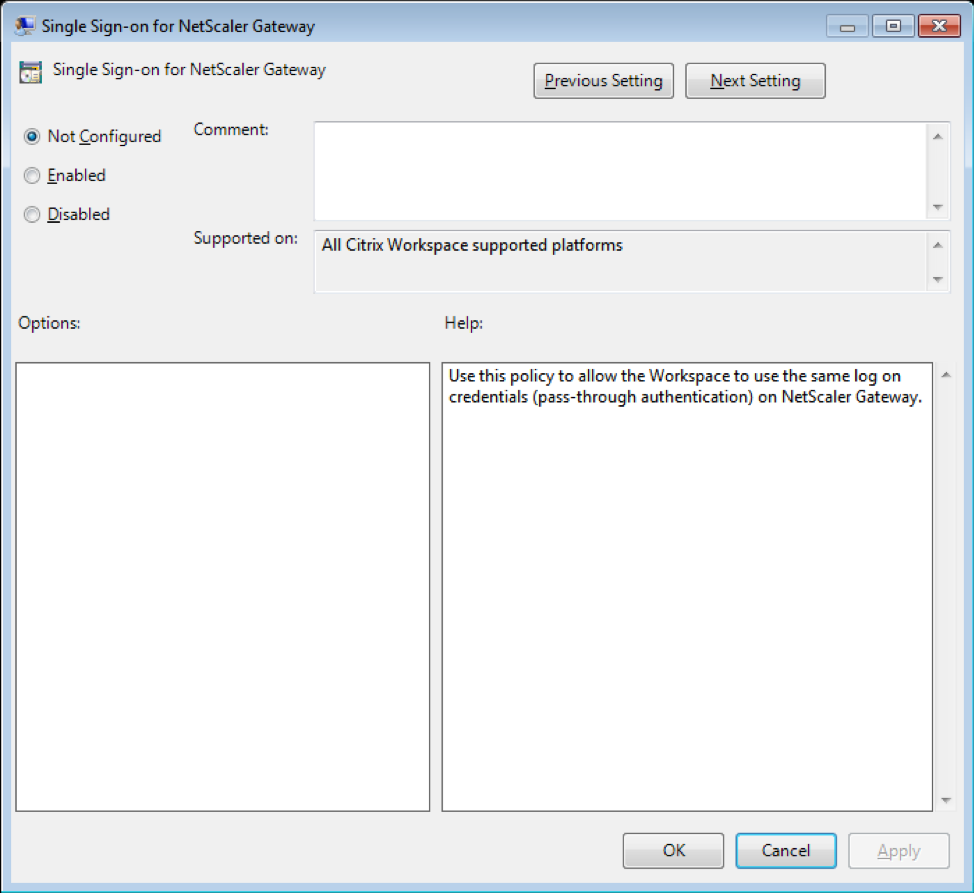

# StoreBrowse Single Sign-on Support of NetScaler Gateway

Single Sign-on lets you authenticate to a domain and use apps and desktops delivered by that domain without having to re-authenticate to each app or desktop. When you add a store using the StoreBrowse utility, your credentials are passed through to NetScaler Gateway server, along with the apps and desktops enumerated for you, including your Start menu settings. After configuring Single Sign-on, you can add the store, Enumerate the Apps/Desktops, Launch the required resource without having to type your credentials multiple times.

## Pre-requisites for Single Sign-On for NetScaler Gateway Server

For the pre-requisites on how to configure Single Sign-On for NetScaler Gateway, please refer the [link](https://docs.citrix.com/en-us/receiver/windows/current-release/authentication/config-pass-through.html). 

The Single Sign-On feature with NetScaler Gateway can be enabled through Group Policy. Below is the step to enable the Single Sign-On for NetScaler Gateway URL:

**Note**: When you upgrade from Citrix Receiver to Citrix Workspace App or fresh install Citrix workspace for the first time, you must add the latest template files to the local GPO. For more information on adding template files to the local GPO, see [https://docs.citrix.com/en-us/receiver/windows/current-release/configure/config-gpo-template.html](https://docs.citrix.com/en-us/receiver/windows/current-release/configure/config-gpo-template.html). In case of an upgrade, the existing settings are retained when the latest files are imported. 

1.	Open the Citrix Receiver GPO administrative template by running `gpedit.msc`
2.	Under the Computer Configuration node, go to **Administrative Template** > **Citrix Component** > **Citrix Workspace** > **User Authentication** > **Single Sign-on for NetScaler Gateway**
3.	Use the toggle options to Enable/Disable the single sign-on option
    